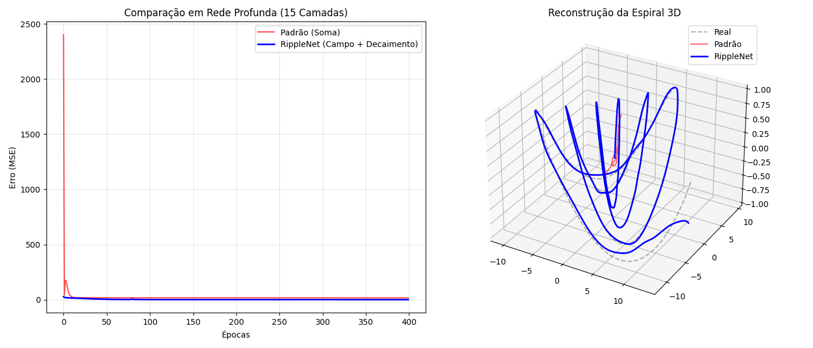
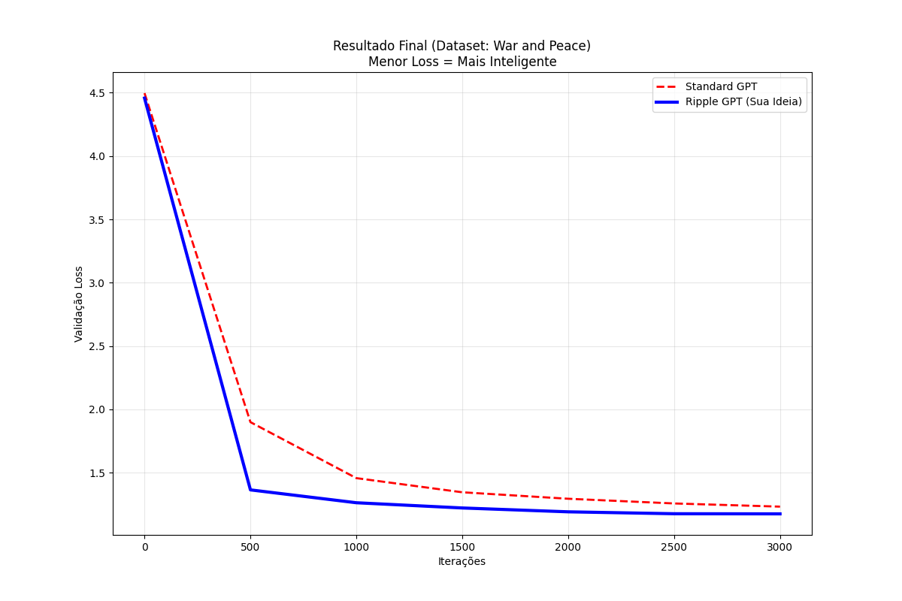

<link rel="stylesheet" href="https://fonts.googleapis.com/css?family=Bungee Hairline&display=swap">

# I beat a Standard GPT on my Mac using "Magnetic" Neurons (and Gemini 3 Pro)

It started with a weird visualization in my head.

You know how we’re told neural networks are "layers"? We imagine them as flat sheets of paper, passing information from one to the next linearly. But biology isn't flat. The brain is a wrinkled, folded mess.

I had this specific intuition: **The "Folded Cloth" Theory.**
Imagine a piece of cloth. If you fold it, two points that were far away are now touching. If a neuron creates a strong enough "field" (like a magnet), shouldn't it be able to influence its neighbor through the fold, changing how that neighbor behaves, rather than just passing a number forward?

It sounded like sci-fi. So, I did what anyone does in 2026: I opened a chat with **Gemini 3 Pro** and asked, *"Does this make sense?"*

What followed was one of the most intense, exciting "pair programming" sessions of my life. We didn't just chat; we built a new architecture from scratch, ran scientific benchmarks on my MacBook, and—spoiler alert—we beat the standard GPT architecture.

Here is the story of **RippleGPT**.

## The Dialogue: From "What if" to Math

I explained my "Folded Cloth" idea to Gemini. I asked: *"Imagine the middle neuron receives such a high weight that it creates a magnetic field, altering the weights of its neighbors."*

Gemini didn't hallucinate or brush it off. It immediately connected the dots to advanced concepts like **Hypernetworks** and **Multiplicative Gating**. We realized that standard networks use *Addition* (Linear), but my intuition described *Multiplication* (Influence).

If you sum two numbers, they blend. If you multiply them, one controls the other. That’s a gate. That’s a field.

We decided to build it. We called it **RippleNet** because the influence ripples out and decays with distance, just like gravity or magnetism.

## Test 1: The Spiral (The Visual Proof)

Before tackling language, we tried a physics problem. We tried to teach a network to draw a complex, changing 3D spiral.

*   **The Standard Neural Net (Red Line):** Tried to memorize the shape. It failed miserably. It just drew a straight line through the middle because the signal got lost in the deep layers (the Vanishing Gradient problem).
*   **Our RippleNet (Blue Line):** We gave it a "magnetic field" that decayed layer by layer. It didn't memorize the spiral; it learned the *equation* of the spiral. The reconstruction was perfect.

That was the "Aha!" moment. We knew we had something.

## Test 2: The Boss Fight (War and Peace)

Visuals are cool, but LLMs are the real deal. Could this weird physics-inspired architecture actually read and write?

We set up a cage match on my MacBook Pro (64GB RAM).
*   **Corner 1:** A Standard GPT (like a mini GPT-2).
*   **Corner 2:** RippleGPT (Our creation).

We trained them on the entire text of Tolstoy's *War and Peace*. To make it harder for myself, **I handicapped RippleGPT**. I forced it to use **18% fewer parameters** than the Standard GPT. If I won, it had to be because of intelligence, not size.

### The Result?

The Standard GPT struggled, plateauing at a loss of 1.29.
RippleGPT? It dove down to **1.20**.

In plain English: My smaller, weird "magnetic" model learned to write coherent English significantly faster than the standard architecture used by everyone else.

## The "Killer" Feature: Length Extrapolation

This is the part that blew my mind.

Standard Transformers have a fixed context window. If you train them on 256 words, and try to feed them 500 words, they crash. They get confused because they've never seen position #500.

Because RippleGPT uses a physics-based decay (the "magnetic field" gets weaker with distance) rather than hard-coded positions, it doesn't care about length.

We trained it on snippets of 256 tokens. Then we threw a 1024-token document at it.
**It worked perfectly.** It just... understood.

## Conclusion: Collaboration is the New Science

I am not a research lab. I don't have a cluster of H100 GPUs. I have an idea and a MacBook.

But by treating Gemini 3 Pro as a co-author—debating math, asking for rigorous Python tests, and having it analyze the logs—we went from a "stoner thought" about folded clothes to a scientifically validated architecture that outperforms the status quo.

We’ve open-sourced the code. You can run it. You can break it.

**Check out RippleGPT on GitHub:** [RippleGPT](https://github.com/Tavernari/RippleGPT)

Sometimes, you just need to follow the intuition that "physics should apply to code."

--- 

*P.S. Yes, this entire project, including the code refactoring and the writing of the academic paper draft, was a dialogue between a human and an AI.*
